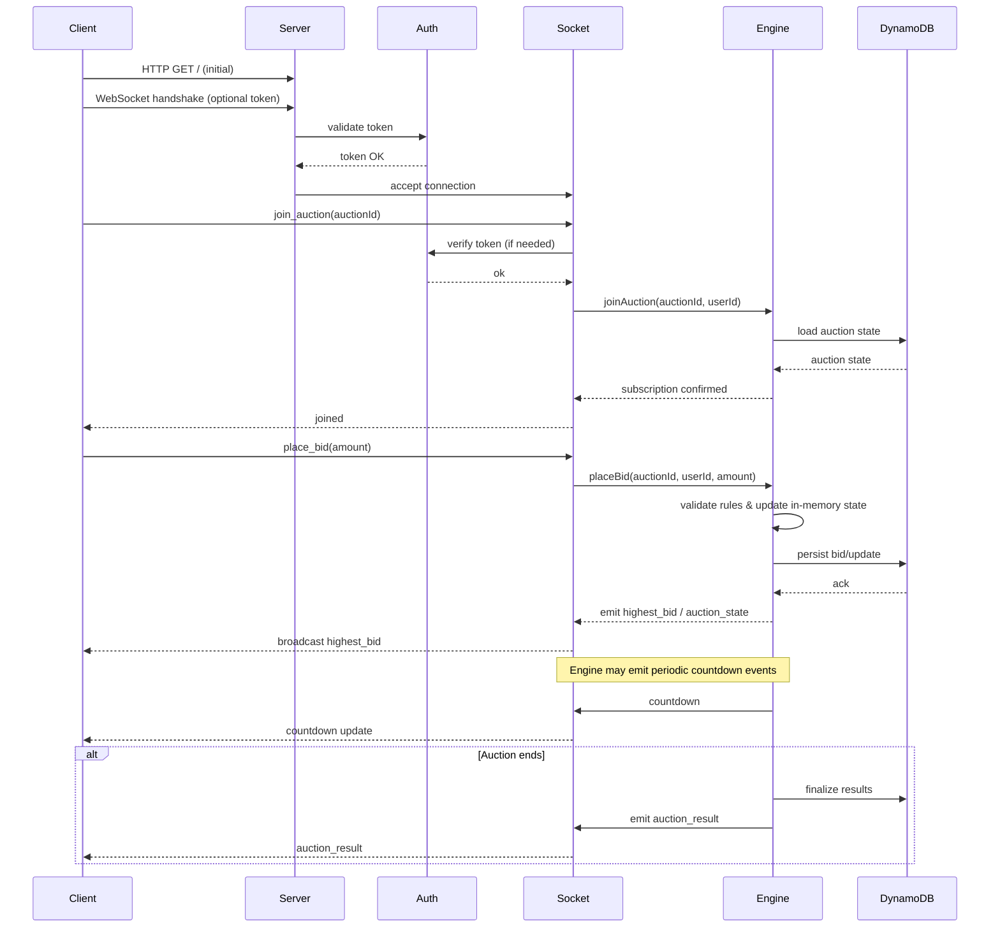

# Auction Flow — Sequence Diagram

The diagram below shows a typical client-server interaction for joining an auction and placing bids.

This file is illustrative — use it to export PNG/SVG from Mermaid tools or convert into a diagram in docs.
